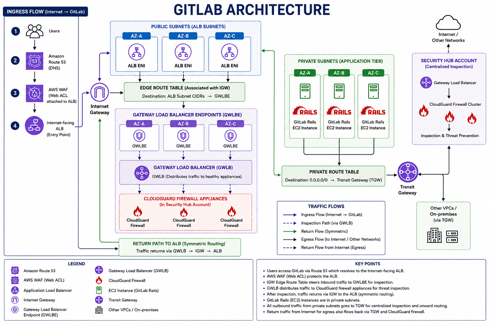

# GitLab on AWS — Architecture Overview

This repository contains the high level architecture and traffic flow of the GitLab environment hosted on AWS. The architecture follows a secure, highly available, and scalable design with centralized security inspection using Gateway Load Balancer and Transit Gateway.

---

## Architecture Diagram

---

## Architecture Summary

- A dedicated **Security Hub Account** is used for centralized network inspection — isolating security controls from workload accounts.
- All inbound and outbound traffic from Internet / Other Networks is routed through this account before reaching application workloads.
- **Gateway Load Balancer (GWLB)** transparently distributes traffic to the firewall cluster without requiring changes to application routing.
- **CloudGuard Firewall Cluster** performs deep packet inspection, threat detection, and prevention on all traffic flows.
- This design enables centralized visibility, policy enforcement, and threat prevention across multiple connected accounts or VPCs.

---

## Components and Their Purpose

| Component | Purpose |
|---|---|
| **Internet / Other Networks** | Source of inbound traffic — public internet or connected corporate/partner networks. |
| **Security Hub Account** | Dedicated AWS account for centralized security inspection — isolates firewall infrastructure from application workloads. |
| **Gateway Load Balancer (GWLB)** | Transparently distributes traffic to firewall appliances at Layer 3/4 without altering packet headers. Enables horizontal scaling of inspection capacity. |
| **CloudGuard Firewall Cluster** | Check Point CloudGuard next-generation firewall cluster — performs deep packet inspection, IDS/IPS, threat intelligence, and malware prevention. |
| **Inspection & Threat Prevention** | Enforcement layer — blocks, allows, or logs traffic based on firewall policies, threat signatures, and behavioral analysis. |

---

## Traffic Flow

    Internet / Other Networks
            |
    Gateway Load Balancer (GWLB)
            |
    CloudGuard Firewall Cluster
            |
    Inspection & Threat Prevention
            |
    Application Workloads (Spoke VPCs / Accounts)

---

## Design Principles

### Centralized Inspection
- Single security account hosts all firewall infrastructure.
- All spoke accounts route traffic through the Security Hub Account.
- Simplifies policy management, audit, and compliance reporting.

### Transparent Inspection via GWLB
- Operates at Layer 3 using GENEVE tunneling protocol (UDP 6081).
- Firewall appliances inspect traffic without source/destination awareness.
- Supports horizontal scaling without routing changes.

### High Availability
- CloudGuard Firewall Cluster provides active/active or active/passive HA.
- GWLB health-checks firewall instances and reroutes traffic automatically on failure.
- No single point of failure in the inspection path.

---

## Key Ports and Protocols

| Protocol | Usage |
|---|---|
| GENEVE (UDP 6081) | GWLB encapsulation between GWLB and firewall appliances |
| TCP 80 / 443 | HTTP/HTTPS application traffic inspection |
| TCP 22 | SSH traffic inspection |
| All protocols | Configurable — GWLB forwards all traffic to firewall for inspection |

---

## Integration Pattern — Hub and Spoke

    +-------------------------------------+
    |        Security Hub Account         |
    |  GWLB -> CloudGuard Firewall Cluster|
    +----------------+--------------------+
                     | Transit Gateway / GWLB Endpoints
          +----------+-----------+
          |          |           |
     Spoke VPC  Spoke VPC   Spoke VPC
     (App A)    (App B)     (App C)

---

## Key Benefits

- **Centralized visibility** — single pane of glass for all network traffic inspection across accounts.
- **Transparent inspection** — no application changes required; GWLB handles traffic steering.
- **Scalable firewall capacity** — CloudGuard cluster scales horizontally behind GWLB.
- **High availability** — GWLB health checks ensure automatic failover between firewall instances.
- **Separation of duties** — security infrastructure isolated in a dedicated account, separate from workloads.
- **Compliance-ready** — centralized logging and inspection supports SOC 2, ISO 27001, and NIST CSF requirements.
