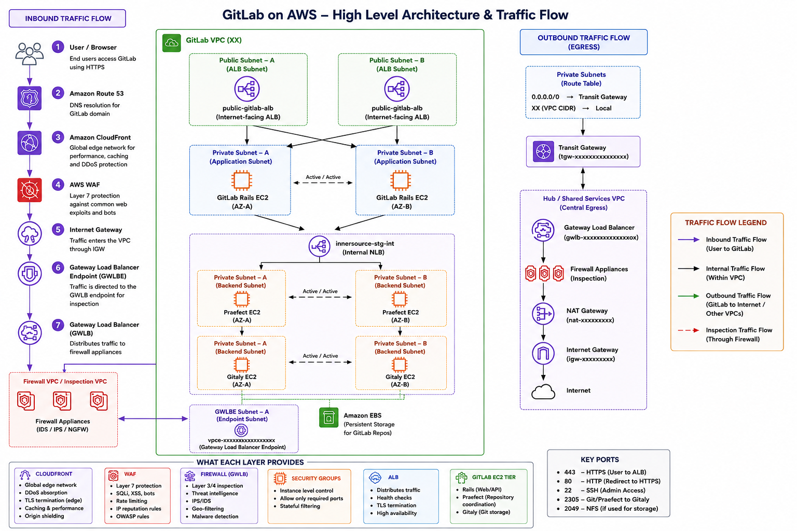

# GitLab on AWS — Architecture Overview

This repository contains the high level architecture and traffic flow of the GitLab environment hosted on AWS. The architecture follows a secure, highly available, and scalable design with centralized security inspection using Gateway Load Balancer and Transit Gateway.

---

## Architecture Diagram

---

## Architecture Summary

- Users access GitLab over HTTPS via CloudFront.
- Traffic is protected by AWS WAF and inspected by firewall appliances before reaching the application.
- GitLab components run in private subnets across multiple AZs.
- Internal communication uses an Internal NLB.
- Outbound traffic is routed through Transit Gateway to a centralized egress VPC for inspection and Internet access.

---

## Components and Their Purpose

| Component | Purpose |
|---|---|
| Amazon Route 53 | DNS resolution for GitLab domain. |
| Amazon CloudFront | Global edge delivery, caching, and DDoS protection. |
| AWS WAF | Application layer (Layer 7) protection against common web attacks and bots. |
| Internet Gateway | Entry point for internet traffic into the VPC. |
| Gateway Load Balancer Endpoint (GWLBE) | Endpoint in the VPC used to route traffic to the Gateway Load Balancer for inspection. |
| Gateway Load Balancer (GWLB) | Distributes traffic to firewall appliances transparently. |
| Firewall Appliances | Performs network and threat inspection (IDS/IPS/NGFW). |
| Public Application Load Balancer | Internet-facing ALB that routes traffic to GitLab Rails EC2. |
| GitLab Rails EC2 | Handles web requests, API authentication, and GitLab application logic. |
| Internal Network Load Balancer | Internal load balancer for backend GitLab services. |
| Praefect EC2 | Coordinates Gitaly nodes and repository state. |
| Gitaly EC2 | Handles Git data storage and repository operations. |
| Amazon EBS | Persistent storage for GitLab repositories and data. |
| Transit Gateway | Connects the GitLab VPC to hub/shared VPCs. |
| Central Egress VPC | Provides centralized inspection, NAT, and internet access. |
| NAT Gateway | Allows outbound internet access for private resources. |
| Security Groups | Instance-level firewall rules to allow required traffic only. |

---

## Traffic Flow

- **Inbound:** User → Route53 → CloudFront → WAF → IGW → GWLBE → GWLB → Firewall → ALB → GitLab Rails EC2
- **Internal:** ALB → Rails EC2 → Internal NLB → Praefect → Gitaly
- **Outbound:** Private Subnets → Transit Gateway → GWLB → Firewall → NAT Gateway → Internet

---

## What Each Layer Provides

| Layer | Responsibilities |
|---|---|
| **CloudFront** | Global edge network, DDoS absorption, TLS termination, caching & performance, origin shielding |
| **WAF** | Layer 7 protection, SQLi/XSS/bots, rate limiting, IP reputation rules, OWASP rules |
| **Firewall (GWLB)** | Layer 3/4 inspection, threat intelligence, IPS/IDS, geo-filtering, malware detection |
| **Security Groups** | Instance level control, allow only required ports, stateful filtering |
| **ALB** | Distributes traffic, health checks, TLS termination, high availability |
| **GitLab EC2 Tier** | Rails (Web/API), Praefect (repository coordination), Gitaly (Git storage) |

---

## Key Ports

| Port | Usage |
|---|---|
| 443 | HTTPS (User to ALB) |
| 80 | HTTP (Redirect to HTTPS) |
| 22 | SSH (Admin Access) |
| 2305 | Git/Praefect to Gitaly |
| 2049 | NFS (if used for storage) |

---

## Key Benefits

- Defense in depth with WAF + Firewall inspection.
- High availability across multiple AZs.
- Centralized egress and security operations.
- Scalable and compliant architecture.

